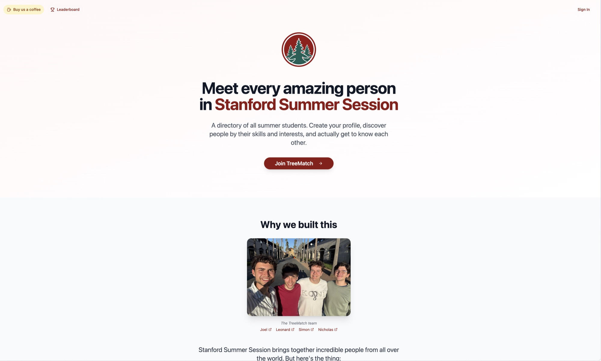
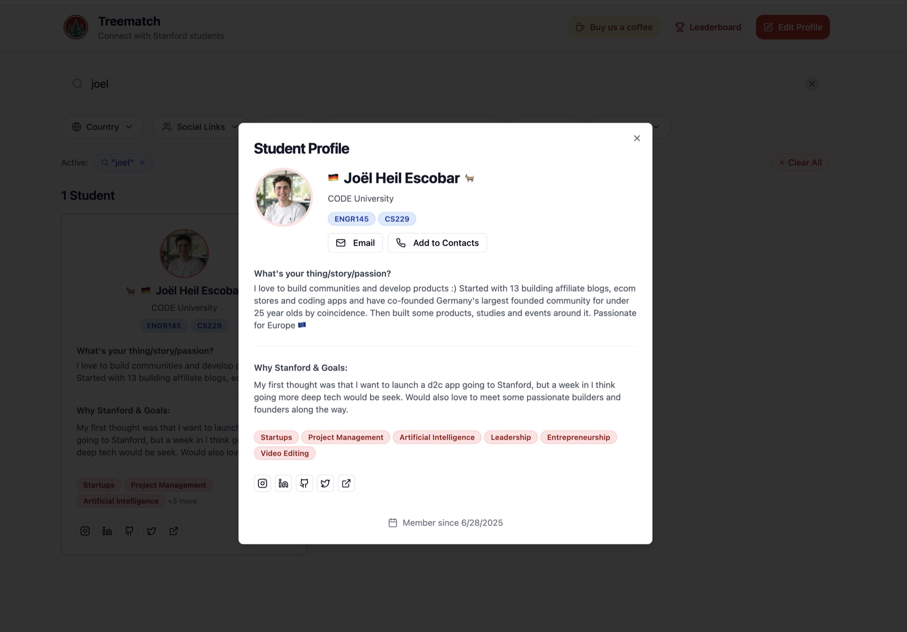

# TreeMatch

Find every student in Stanford Summer Session by skills, courses and interests.

**Live:** https://treematch.vercel.app · **License:** MIT



## Why we built it

Stanford Summer Session puts hundreds of students from all over the world on one campus for eight weeks. You meet your dorm and the people in your two classes. Everyone else stays a face in the dining hall. Eight weeks is not enough time to meet everyone, so you want to find the few people who matter to you fast.

TreeMatch is a directory of the whole session. You fill in a profile in two minutes: what you build, which courses you take, what you want out of the summer, your socials. Then you search everyone else by skill, course or country, like the ones you want to meet, and write to them over email or LinkedIn.

We built it in the first two weeks of the 2025 session: [Simon](https://www.linkedin.com/in/simon-gneuss/), [Joel](https://www.linkedin.com/in/joel-heil-escobar/), [Nicholas](https://www.linkedin.com/in/nicholas-rodrigues-/) and [Leonard](https://www.linkedin.com/in/leonarddarsow/). The first commit on June 22 was a swipe-to-match prototype. It became a searchable directory the same week. Around 60 students joined over the summer.

## What it does



- Sign-up limited to `@stanford.edu` addresses, with password or magic link
- Onboarding in seven steps: basics, photo, courses, skills, current project, goals, socials
- Directory with search and filters for country, skills, courses, social links and "looking for an ENGR 145 team"
- Like students, filter for the ones you liked, see mutual likes
- Referral links and a leaderboard to get the rest of the session on
- Contact card export and a share button for the whole thing

## How it is built

| Part | Choice | Why |
|---|---|---|
| Framework | Next.js 14, App Router, TypeScript | Started on Vite. Moved to Next.js on day one for the auth callback route and middleware. Magic links need a server. |
| Backend | Supabase: Auth, Postgres, Storage | One service for login, data and avatars. Nothing to host. Row level security keeps each student's writes to their own row. |
| Data fetching | TanStack React Query | Profile and directory data are cached and invalidated after each onboarding step. |
| UI | Tailwind CSS, shadcn/ui, Lucide | Fast to build, easy to keep consistent across four people. |
| Forms | react-hook-form, zod | Validation on every onboarding step. |
| Images | browser-image-compression | Avatars are compressed in the browser before upload, so storage stays small and pages load fast. |
| Analytics | PostHog, optional | Where people drop out of onboarding. |
| Tests | Jest, React Testing Library | Hooks and the login flow. |
| Hosting | Vercel | Deploys on push. |

## What we learned

Most of the bug fixes in the history are auth: magic links, duplicate Supabase clients, row level security with server side rendering. If you build on Supabase, budget a full day for auth before anything else.

We shipped on day two and fixed in production for two weeks. 276 commits from four people, a lot of them named "fix". For something that only had to live eight weeks, that was the right trade.

## Run it locally

1. Install dependencies:

```bash
npm install
```

2. Create a Supabase project and run `supabase-migrations.sql` in the SQL editor. It creates the tables, RLS policies, storage buckets and seed skills and courses. If avatar uploads fail, run `fix-storage.sql` too.

   Existing project from before September 2026: run `supabase-hardening.sql` once. It locks the old temp-avatars bucket and adds the server-side Stanford email check.

3. Copy the env file and fill in your Supabase URL and anon key from Settings > API:

```bash
cp env.example .env.local
```

4. Start the dev server:

```bash
npm run dev
```

Open http://localhost:3000.

## Environment variables

| Variable | Required | Description |
|---|---|---|
| `NEXT_PUBLIC_SUPABASE_URL` | Yes | Supabase project URL |
| `NEXT_PUBLIC_SUPABASE_ANON_KEY` | Yes | Supabase anon key |
| `NEXT_PUBLIC_POSTHOG_KEY` | No | PostHog project key |
| `NEXT_PUBLIC_POSTHOG_HOST` | No | PostHog host, defaults to EU |
| `SUPABASE_PROJECT_ID` | No | Only for `npm run update-types` |

Never commit `.env.local`. The anon key is safe to ship to the browser, but all data access must stay behind the RLS policies in `supabase-migrations.sql`.

## Scripts

| Script | What it does |
|---|---|
| `npm run dev` | Dev server |
| `npm run build` | Production build |
| `npm run start` | Serve the production build |
| `npm run lint` | ESLint |
| `npm test` | Jest |
| `npm run update-types` | Regenerate `src/integrations/supabase/types.ts` from your Supabase schema |

## Project structure

```
src/
  app/            Next.js routes: auth, welcome (onboarding), edit, meet, referrals, invite
  components/     UI, onboarding steps, student cards, referral leaderboard
  integrations/   Supabase clients and React Query hooks
  hooks/          Shared hooks
  lib/            Utilities and validation
  types/          Shared types
supabase-migrations.sql   Schema, RLS policies, buckets, seed data
supabase-hardening.sql    One-time security fixes for existing projects
fix-storage.sql           Storage bucket policies for avatar uploads
middleware.ts             Route protection
```

## Adapting it for your school

The Stanford parts are small: the email domain check in `src/app/auth/login/page.tsx`, `src/components/onboarding/steps/EmailStep.tsx` and the `enforce_stanford_email` trigger, the course list in `src/components/onboarding/steps/CoursesStep.tsx`, and the colors in `tailwind.config.ts`. Change those and it works for any program.

## Security

See [SECURITY.md](./SECURITY.md) for the measures in place and how to report a vulnerability.

## License

MIT, see [LICENSE](./LICENSE).
